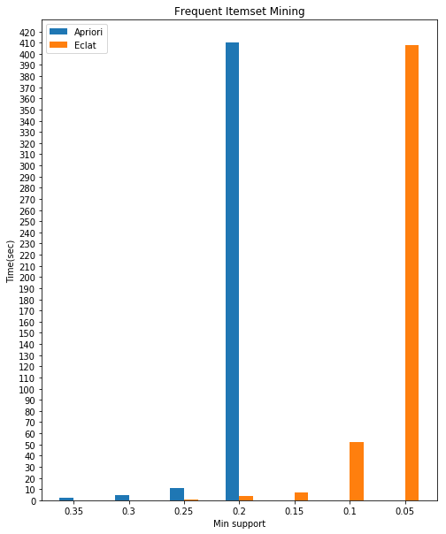

[](https://lgtm.com/projects/g/jeffwang0516/Frequent-Itemset-Mining/alerts/)

# Frequent-Itemset-Mining

Implementation of Apriori and Eclat

## Environment
- python 3.6

## Execution

### Args
```sh
$1: input file
$2: min support ratio (0 < $2 < 1)
$3: output file
```

### Algorithms

- Apriori
  ```sh
  $ bash apriori.sh $1 $2 $3
  ```

- Eclat
  - CPU
    ```sh
    $ bash eclat_cpu.sh $1 $2 $3
    ```
    
  - GPU
    ```sh
    $ bash eclat_gpu.sh $1 $2 $3
    ```

## Performance Comparison

